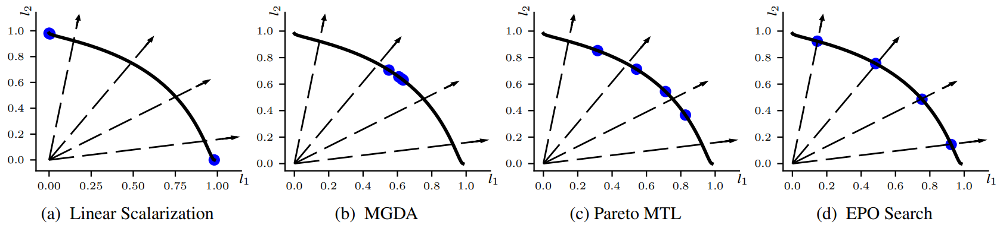
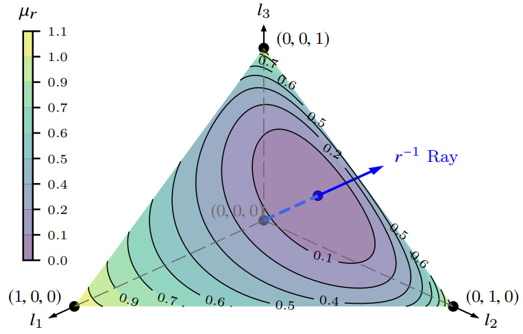

# Multi-Task Learning with User Preferences: Gradient Descent with Controlled Ascent in Pareto Optimization - ICML 2020 

## 1. Abstract
- Một yêu cầu phổ biến trong các ứng dụng MTL mà các phương pháp cũ không thể giải quyết được là tìm một nghiệm thỏa mãn các ưu tiên do người dùng chỉ định đối với các hàm mất mát theo từng tác vụ. 
- Chúng tôi phát triển thuật toán MTL đa mục tiêu dựa trên gradient đầu tiên để giải quyết vấn đề này. Cách tiếp cận độc đáo của chúng tôi kết hợp nhiều bước giảm gradient (multiple gradient descent) với bước tăng được kiểm soát cẩn thận (carefully controlled ascent) để duyệt biên Pareto theo một cách có nguyên tắc, điều này cũng làm cho nó bền vững với khởi tạo. 
- Khả năng mở rộng của thuật toán cho phép sử dụng nó trong các mạng sâu quy mô lớn cho MTL. Chỉ giả định tính khả vi của các hàm mất mát theo tác vụ, chúng tôi cung cấp các đảm bảo lý thuyết về sự hội tụ. 
- Các thí nghiệm cho thấy thuật toán của chúng tôi vượt trội so với các phương 
pháp cạnh tranh tốt nhất trên các bộ dữ liệu chuẩn.

## 2. Introduction
Tính hiệu quả của tối ưu hóa đa mục tiêu cho MTL lần đầu tiên được chứng minh bởi \cite{Sener2018}. Thuật toán của họ mở rộng thuật toán MGDA \cite{Desideri2012} để xử lý các gradient có số chiều cao, từ đó phù hợp với MTL quy mô lớn với mạng sâu. Tuy nhiên, phương pháp của họ tìm ra một nghiệm tùy ý từ tập Pareto và không thể được sử dụng để khám phá các nghiệm có sự đánh đổi khác nhau. Hạn chế này được nhận ra bởi \cite{Lin2019}, những người giải quyết một phần vấn đề này bằng cách phân tách bài toán MTL và giải nhiều bài toán con với các sự đánh đổi khác nhau. Phương pháp của họ cho ra một tập hợp các nghiệm Pareto tối ưu phân bố trên biên Pareto.

Trong nhiều ứng dụng MTL, người dùng có thể muốn khám phá các nghiệm với các sự đánh đổi cụ thể dưới dạng sở thích hoặc mức độ ưu tiên giữa các tác vụ. Cho trước các sở thích $r_j$ cho mỗi tác vụ, yêu cầu một nghiệm Pareto tối ưu sao cho với hai tác vụ bất kỳ, nếu $r_i \geq r_j$ thì các mất mát tương ứng thỏa mãn $l_i \leq l_j$. Chúng tôi gọi một nghiệm như vậy là nghiệm Pareto tối ưu theo sở thích cụ thể (preference-specific Pareto optimal).

Việc tìm các nghiệm Pareto tối ưu theo sở thích cụ thể là thách thức và không thể giải quyết bằng tuyến tính hóa vô hướng hay các phương pháp MTL đa mục tiêu hiện có. Một vector sở thích xác định một hướng và dẫn đến một điểm trên biên Pareto. Các phương pháp hiện tại không thể được sử dụng để đạt đến một điểm cụ thể trên biên Pareto. Các đóng góp của chúng tôi trong bài báo này là:

- Chúng tôi phát triển thuật toán MTL đa mục tiêu dựa trên gradient đầu tiên, được gọi là Tìm kiếm Pareto Tối ưu Chính xác (Exact Pareto Optimal Search) để tìm một nghiệm Pareto tối ưu theo sở thích cụ thể.

- Cách tiếp cận độc đáo của EPO Search kết hợp gradient descent và bước tăng được kiểm soát cẩn thận, cho phép nó: 
    - Duyệt biên Pareto cho đến khi nghiệm yêu cầu được tìm thấy, làm cho nó bền vững với khởi tạo
    - Tìm nghiệm Pareto tối ưu gần nhất với sở thích nếu nghiệm chính xác không tồn tại
    - Tìm nhiều nghiệm trên biên Pareto theo cách có nguyên tắc nếu có nhiều sở thích
    - Mở rộng tuyến tính với số chiều gradient và do đó huấn luyện hiệu quả các mạng sâu quy mô lớn cho MTL

- Giả định tính khả vi của các hàm mất mát (không cần hàm lồi), chúng tôi chứng minh rằng EPO Search hội tụ đến nghiệm Pareto tối ưu chính xác theo sở thích cụ thể.

- Các thí nghiệm trên dữ liệu tổng hợp và thực tế chứng minh sự vượt trội của EPO Search so với các phương pháp tiên tiến nhất.

## 3. Preliminaries
Chúng tôi xem xét $m$ tác vụ, mỗi tác vụ có hàm mục tiêu không âm $l_j : \mathbb{R}^n \to \mathbb{R}_+$, $j \in [m]$. Hàm vector $l : \mathbb{R}^n \to \mathbb{R}^m$ là ánh xạ từ không gian nghiệm (solution space) $\mathbb{R}^n$ đến không gian mục tiêu (objective space) $\mathbb{R}^m$. Chúng tôi sử dụng $l$ để ký hiệu cả hàm mất mát lẫn một điểm trong $\mathbb{R}^m$, tùy theo ngữ cảnh. Miền giá trị của $l$, ký hiệu là $\mathcal{O}$, là một tập con của nón dương:

$$
\mathbb{R}^m_+ := \{l \in \mathbb{R}^m \mid l_j \geq 0\ \forall j \in [m]\}. \tag{1}
$$

Quan hệ thứ tự bộ phận cho hai điểm $l^1, l^2 \in \mathbb{R}^m$, ký hiệu $l^1 \geqslant l^2$, được định nghĩa bởi $l^1 - l^2 \in \mathbb{R}^m_+$, tức là $l^1_j \geq l^2_j$ với mọi $j \in [m]$ và bất đẳng thức nghiêm ngặt $l^1 > l^2$ xảy ra khi tồn tại ít nhất một $j$ sao cho $l^1_j > l^2_j$. Về mặt hình học, $l^1 > l^2$ có nghĩa là $l^1$ nằm trong nón dương tại $l^2$, tức là $l^1 \in \{l^2\} + \mathbb{R}^m_+ := \{l^2 + l \mid l \in \mathbb{R}^m\}$ và $l^1 \neq l^2$.

Trong bối cảnh tối thiểu hóa, nghiệm $\theta^1 \in \mathbb{R}^n$ bị thống trị bởi nghiệm khác $\theta^2 \in \mathbb{R}^n$ khi và chỉ khi $l(\theta^1) \geqslant l(\theta^2)$. Lưu ý rằng $l(\theta^1) \not\geqslant l(\theta^2)$ nếu $l(\theta^1) \notin \{l(\theta^2)\} + \mathbb{R}^m_+$. Nghiệm $\theta^*$ là Pareto tối ưu nếu nó không bị thống trị bởi bất kỳ nghiệm nào khác. Tập tất cả các nghiệm Pareto tối ưu toàn cục được cho bởi:

$$
\mathcal{P}_{glo} := \{\theta^* \in \mathbb{R}^n \mid \forall \theta \in \mathbb{R}^n - \{\theta^*\},\ l(\theta^*) \not\geqslant l(\theta)\}. \tag{2}

$$

Chúng tôi quan tâm đến các nghiệm Pareto tối ưu cục bộ:

$$
\mathcal{P} := \left\{\theta^* \in \mathbb{R}^n \;\middle|\; \begin{array}{l} \exists\, \mathcal{N}(\theta^*) \subset \mathbb{R}^n \mid \\ \forall \theta \in \mathcal{N}(\theta^*) - \{\theta^*\},\\ l(\theta^*) \not\geqslant l(\theta) \end{array} \right\}, \tag{3}
$$
trong đó $\mathcal{N}(\theta^*)$ là một lân cận mở của $\theta^*$. Lưu ý rằng $\mathcal{P}_{glo} \subset \mathcal{P}$. Tập các giá trị đa mục tiêu của các nghiệm Pareto tối ưu, $l(\mathcal{P}) \subset \mathcal{O}$, được gọi là biên Pareto (Pareto front).

### 3.1 Gradient-based Multi-Objective Optimization
Trong MOO dựa trên gradient, chúng tôi tìm nghiệm Pareto tối ưu bằng cách bắt đầu từ khởi tạo tùy ý $\theta^0 \in \mathbb{R}^n$ và lặp đi lặp lại tìm nghiệm tiếp theo $\theta^{t+1}$ thống trị nghiệm trước $\theta^t$ (tức là $l^{t+1} \leqslant l^t$, trong đó $l^t := l(\theta^t)$), bằng cách di chuyển $\theta^{t+1} = \theta^t - \eta d$, sao cho bước giảm xảy ra ở mọi mục tiêu: $l^{t+1}_j \leqslant l^t_j$. Điều này chỉ có thể xảy ra nếu $d$ có góc dương với gradient của mọi hàm mục tiêu tại $\theta^t$.

Đặt $g_j = \nabla_\theta l_j$ là gradient của hàm mục tiêu thứ $j$ tại $\theta$, và $G \in \mathbb{R}^{n \times m}$ là ma trận có $g_j$ là cột thứ $j$. Hướng giảm (descent direction) $d_{des}$ được cho bởi $d_{des}^T g_j \geq 0$ với mọi $j \in [m]$. Do đó, di chuyển ngược chiều $d_{des}$, bắt đầu từ $\theta$, dẫn đến sự giảm giá trị mục tiêu, không có thay đổi khi $d_{des}^T g_j = 0$.

\cite{Desideri2012} chứng minh rằng các hướng giảm có thể được tìm thấy trong bao lồi (Convex Hull) của các gradient, được định nghĩa bởi:
$$
\mathcal{CH}_\theta := \{G\beta \mid \beta \in \mathcal{S}^m\}, \tag{4}
$$
trong đó:

$$
\mathcal{S}^m := \left\{\beta \in \mathbb{R}^m_+ \;\middle|\; \sum_{j=1}^m \beta_j = 1\right\} \tag{5}
$$
là đơn hình chính quy (regular simplex) $m$-chiều, và MGDA hội tụ đến một nghiệm Pareto tối ưu cục bộ bằng cách lặp đi lặp lại sử dụng hướng giảm:

$$
d^* = \arg\min_{d \in \mathcal{CH}_\theta} \|d\|_2^2. \tag{6}
$$

\cite{Sener2018} thiết kế phương pháp giải (6) có khả năng mở rộng cho các gradient số chiều cao.

### 3.2 Problem Statement
Cho trước các sở thích tương đối cho mỗi tác vụ $r_j > 0$, $j \in [m]$, chúng tôi muốn tìm nghiệm Pareto tối ưu $\theta_r^* \in \mathcal{P}$ sao cho, nếu $r_i \geq r_{j'}$ thì $l_i(\theta_r^*) \leq l_{j'}(\theta_r^*)$.

**Hạn chế của các phương pháp hiện tại:** Chúng tôi thảo luận ngắn gọn về các cách tiếp cận khả thi để giải bài toán này với các phương pháp MTL hiện có và các hạn chế của chúng. 

- Xét tuyến tính hóa vô hướng sử dụng SOO trong đó các sở thích có thể là trọng số theo tác vụ:

$$
\theta^* = \arg\min_\theta s(\theta) = r^T l(\theta). \tag{7}
$$

- Như đã thảo luận trong \cite{Boyd2004}[Ch 4.7], nếu $\mathcal{O}$ không lồi trong $\mathbb{R}^m$ thì có thể không tìm được $\theta_r^*$ như vậy; và $\theta_r^*$ mong muốn chỉ có thể được tìm thấy nếu $\mathcal{O}$ lồi gần $l(\theta_r^*)$ và khởi tạo $\theta^0$ để giải (7) đủ gần $\theta_r^*$.

- Trong các thuật toán dựa trên MGDA (ví dụ \cite{Sener2018}), sử dụng $d_{des}$ chúng tôi chỉ có thể tìm được nghiệm thống trị nghiệm trước, mà không có bất kỳ kiểm soát nào về việc di chuyển về phía sở thích. Do đó, tùy thuộc vào khởi tạo $\theta^0$, thuật toán có thể đạt đến bất kỳ nghiệm Pareto tối ưu cục bộ nào. Điều này cũng đã được xác minh bằng thực nghiệm bởi \cite{Lin2019}.

- Thuật toán Pareto MTL (PMTL) của \cite{Lin2019} tìm nhiều nghiệm trên biên Pareto. Thuật toán của họ sử dụng nhiều vector tham chiếu $u_k$, $k = 1, \ldots, K$ để phân vùng không gian nghiệm thành $K$ vùng con $\Omega_k := \{\theta \in \mathbb{R}^n \mid u_k^T l(\theta) \geq u_{k'}^T l(\theta)\ \forall k' \neq k\}$ và sau đó có hai pha. Trong pha đầu tiên, bắt đầu từ một điểm ban đầu, họ tìm điểm $\theta^0_0 \in \Omega_k$, sao cho giá trị $u_k$ tương ứng là hướng ưu tiên của $l(\theta_r^*)$. Trong pha thứ hai, họ lặp đi lặp lại sử dụng $d_{des}$ để đạt đến nghiệm Pareto tối ưu $\theta^* \in \mathcal{P}$ gần với $\theta_0^*$ để tìm $l(\theta^*) \in l(\mathcal{P}) \cap l(\Omega_k)$. Tuy nhiên, phương pháp của họ không đảm bảo rằng kết quả pha thứ hai $\theta^*$ cũng nằm trong $\Omega_k$.

- Hơn nữa, để đạt được sự ưu tiên mong muốn, họ phải tăng số lượng $u_k$ theo cấp số nhân khi số lượng nhiệm vụ $m$ tăng lên, điều này khiến nó trở nên không khả thi trên thực tế. Do đó, mặc dù các vectơ tham chiếu của họ có thể dựa trên sở thích của người dùng, nhưng phương pháp của họ, theo thiết kế, không đạt được sự ưu tiên chính xác mà chỉ đạt được trong các vùng con của đường Pareto giữa các tham chiếu.

   
  <em>Figure 1: Biên Pareto và các nghiệm tối ưu Pareto (vòng tròn màu xanh) cho các mức độ ưu tiên khác nhau (tia nét đứt) thu được bằng (a) LS: không thể tìm thấy nghiệm trong phần lõm; (b) Các phương pháp dựa trên MGDA (ví dụ (Sener & Koltun, 2018)): tìm thấy các nghiệm tối ưu Pareto tùy ý (không sử dụng vectơ ưu tiên đầu vào); (c) Pareto MTL (Lin et al., 2019): chia biên Pareto bằng cách sử dụng nhiều vectơ tham chiếu để tìm nghiệm trong các vùng con; (d) EPO Search: có thể tìm thấy các nghiệm chính xác tại bất kỳ vectơ ưu tiên nào.</em>

## 4. Exact Pareto Optimal Search
Nghiệm tối ưu Pareto chính xác (Exact Pareto Optimal - EPO) với vector sở thích $r$ thuộc tập:

$$
\mathcal{P}_r = \{\theta^* \in \mathcal{P} \mid r_1 l_1^* = \cdots = r_j l_j^* = \cdots = r_m l_m^*\},
\tag{8}
$$
trong đó $l_j^* = l_j(\theta^*)$. Lưu ý rằng với bất kỳ nghiệm EPO $\theta_r^*$, $l(\theta_r^*)$ là một điểm trên biên Pareto giao với tia hướng về $r^{-1} := (1/r_1, \cdots, 1/r_m)$ và $r \odot l$ tỷ lệ (proportional) với $\mathbf{1} = (1, \cdots, 1) \in \mathbb{R}^m$, trong đó $\odot$ là toán tử tích từng phần tử (element-wise product). Rõ ràng mọi nghiệm EPO đều là nghiệm Pareto tối ưu theo sở thích cụ thể. Chúng tôi phát triển thuật toán để tìm các nghiệm EPO.

Để tìm các nghiệm EPO, chúng tôi không chỉ cần tìm các hướng giảm về phía biên Pareto mà còn hướng đến các nghiệm thỏa mãn điều kiện trong (8). Để đạt được điều đó, chúng tôi định nghĩa một tiêu chí mới. Với bất kỳ điểm $\theta$ nào trong không gian nghiệm $\mathbb{R}^n$, chúng tôi định nghĩa Tính Phi Đồng Nhất (Non-Uniformity) của các giá trị mục tiêu với vector sở thích $r$ là:
$$
\mu_r(l(\theta)) 
= \sum_{j=1}^m \hat{l}_j(\theta)
\log\left(\frac{\hat{l}_j(\theta)}{1/m}\right), \tag{9}
$$
$$
= \text{KL}\left(
\hat{l}(\theta) \;\middle|\; \frac{\mathbf{1}}{m}
\right), \tag{10}
$$
trong đó $\hat{l}_j$ là chuẩn hóa có trọng số:

$$
\hat{l}_j = \frac{r_j l_j}{\sum_{j'=1}^m r_{j'} l_{j'}}.
\tag{11}
$$

KL divergence của $\hat{l}$ so với phân phối đều $1/m$ phù hợp để mô tả tính phi đồng nhất vì nó định lượng mức độ mà $r_j l_j$ không bằng nhau: $\mu_r(l) = 0$ khi tất cả $r_j l_j$ đều bằng nhau, ngược lại $\mu_r(l)$ là dương ngặt. Hơn nữa, vector chuẩn hóa có trọng số $\hat{l}$ luôn nằm trong $\mathcal{S}^m$.

   
  <em>Figure 2: Biến thiên của độ không đồng nhất trên đơn hình $S^3$ , với vectơ ưu tiên cụ thể r = [0.6, 0.2, 0.2]. Góc nhìn từ hướng (1, 1, 1) về phía gốc tọa độ.</em>

\subsection{Đạt Được Tính Đồng Nhất}

\noindent
Đầu tiên chúng tôi tìm hướng sao cho nếu chúng tôi di chuyển ngược lại với nó, bắt đầu từ $\theta$, thì tính phi đồng nhất của nghiệm mới nhỏ hơn của $\theta$. Chúng tôi sử dụng tổ hợp tuyến tính của $m$ gradient đã biết $g_j \in \mathbb{R}^n$ để xây dựng hướng cân bằng (balancing direction) yêu cầu:

\begin{equation}
d_{bal} = \sum_{j=1}^m g_j a_j
\label{eq:12}
\end{equation}

\noindent
trong đó các trọng số $a_j$ là các độ lệch tương đối tương ứng so với tính phi đồng nhất tổng thể $\mu_r(l)$, mà chúng tôi gọi là điều chỉnh (adjustments):

\begin{equation}
a_j = r_j \left(\log\left(\frac{\hat{l}_j}{1/m}\right) - \mu_r(l)\right).
\label{eq:13}
\end{equation}

\noindent
Chúng tôi chứng minh rằng $d_{bal}$ đảm bảo giảm tính phi đồng nhất.

\begin{theorem}
Nếu tất cả các hàm mục tiêu đều khả vi, thì với bất kỳ hướng $d \in \mathbb{R}^n$ với $d^T d_{bal} > 0$, tồn tại bước $\eta_0 > 0$, sao cho:
\begin{equation}
\mu_r(l(\theta - \eta d)) \leq \mu_r(l(\theta)), \quad \forall \eta \in [0, \eta_0].
\label{eq:14}
\end{equation}
\end{theorem}

\noindent
Lưu ý rằng các điều chỉnh $a_j$ là không âm đối với một số mục tiêu và âm đối với phần còn lại, tức là trừ khi tất cả $r_j l_j$ đều bằng nhau, sẽ luôn có một số mục tiêu có các số hạng gradient trong $d_{bal}$ là âm. Đặt $J = \{j \mid g_j^T d_{bal} > 0\}$ là tập chỉ số của tất cả gradient nằm trong nửa mặt phẳng dương của $d_{bal}$, và $\bar{J} = [m] - J$ là tập chỉ số của các gradient trong nửa mặt phẳng âm của $d_{bal}$. Nếu chúng tôi sử dụng $d_{bal}$ để di chuyển đến nghiệm mới $\theta_\eta^{t+1} = \theta^t - \eta d_{bal}$, thì với bước đủ nhỏ $\eta_0 > 0$:

\begin{equation}
l_j(\theta_\eta^{t+1}) < l_j(\theta^t), \quad \forall j \in J,
\label{eq:15a}
\end{equation}

\begin{equation}
\text{và } l_j(\theta_\eta^{t+1}) \geq l_j(\theta^t), \quad \forall j \in \bar{J}.
\label{eq:15b}
\end{equation}

\noindent
Do đó, khi $d_{bal}$ được sử dụng để cập nhật điểm $\theta^t$, bước giảm gradient xảy ra cho các mục tiêu trong $J$, trong khi bước tăng gradient xảy ra cho các mục tiêu trong $\bar{J}$.

\subsection{Đạt Được Tính Đồng Nhất và Tính Tối Ưu Pareto}

\noindent
Bây giờ chúng tôi tìm hướng cho phép chuyển từ nghiệm $\theta^t$ đến $\theta^{t+1}$ sao cho $\theta^{t+1}$ thống trị $\theta^t$ ($l^{t+1} \leqslant l^t$) hoặc có tính đồng nhất tốt hơn ($\mu_r(l^{t+1}) \leq \mu_r(l^t)$) hoặc cả hai. Nói cách khác, $\theta^{t+1}$ không bị thống trị bởi $\theta^t$ ($l^{t+1} \not\geqslant l^t$). Chúng tôi giải quyết vấn đề này thông qua quy hoạch tuyến tính (LP).

\noindent
Từ \cite{Desideri2012}, chúng tôi biết rằng hướng giảm $d \in \mathcal{CH}_\theta$, bao lồi của các gradient tại $\theta^t$, sẽ hướng về phía biên Pareto. Từ \eqref{eq:4} và \eqref{eq:5}, $d = G\beta$, trong đó $\beta \in \mathcal{S}^m$. Từ Định lý 1, chúng tôi biết rằng di chuyển ngược chiều $d_{bal} = Ga$, sẽ cải thiện tính đồng nhất. Kết hợp hai yêu cầu, chúng tôi muốn tìm hướng trong $\mathcal{CH}_\theta$ có góc cực đại với $d_{bal}$, tức là chúng tôi tối đa hóa:

\begin{equation}
d^T d_{bal} = \beta^T G^T G a = \beta^T C a.
\label{eq:19}
\end{equation}

\noindent
Tuy nhiên, một khi tính đồng nhất đã đạt được, khi $\mu_r(l^t) = 0$ hoặc giá trị đa mục tiêu của vòng lặp hiện tại nằm trên tia $r^{-1}$, chúng tôi có thể vào chế độ "giảm thuần túy" (pure descent mode). Điều này được thực hiện bằng cách tìm hướng trong $\mathcal{CH}_\theta$ có tích vô hướng với tổng tất cả các gradient là cực đại. Do đó chúng tôi tối đa hóa:

\begin{equation}
\sum_{j=1}^m d^T g_j = \beta^T G^T G \mathbf{1} = \beta^T C \mathbf{1}.
\label{eq:20}
\end{equation}

\noindent
Kết hợp \eqref{eq:19} và \eqref{eq:20} cho hàm mục tiêu trong bài toán LP \eqref{eq:24a} với $\mathbb{1}_{\mu_t^l}$ là chỉ thị vô hướng cho $\mu_r(l^t)$ khác không.

\noindent
Trong chế độ giảm thuần túy, tức là khi tối đa hóa \eqref{eq:20}, chúng tôi chỉ cần ràng buộc hướng giảm:

\begin{equation}
d^T g_j = \beta^T G^T g_j = \beta^T c_j \geq 0, \quad \forall j \in [m].
\label{eq:21}
\end{equation}

\noindent
Góc không âm của $d$ với mỗi gradient đảm bảo rằng tất cả các giá trị mục tiêu đều giảm và $\theta^{t+1}$ thống trị $\theta^t$.

\noindent
Khi tối đa hóa \eqref{eq:19}, góc mà $d$ tạo với một số gradient $g_j$ cần phải âm, để cho phép bước tăng cho các mục tiêu có giá trị thấp $r_j l_j^t$ và bước giảm cho các mục tiêu có giá trị cao. Từ \eqref{eq:15b}, chúng tôi biết rằng bước tăng có thể xảy ra cho tất cả các mục tiêu trong $\bar{J}$ nếu $d_{bal} \notin \mathcal{CH}_\theta$. Khi $d_{bal} \notin \mathcal{CH}_\theta$, chúng tôi có thể cho phép $d$ yêu cầu có góc âm với các gradient của các mục tiêu trong $\bar{J}$. Vì $a^T c_j \leq 0$, chúng tôi đạt được điều này bằng cách sửa đổi \eqref{eq:21} thành $\beta^T c_j \geq a^T c_j \mathbb{1}_J$, $\forall j \in \bar{J}$.

\noindent
Khi $d_{bal}$ không tạo góc dương với bất kỳ gradient nào, tức là $J$ rỗng và $\bar{J} = [m]$, chúng tôi không nên cho phép góc âm tiêu cực giữa $d$ và các gradient, để tránh tăng tất cả các giá trị mục tiêu đồng thời. Điều này có thể được đảm bảo bằng cách sử dụng chỉ thị vô hướng $\mathbb{1}_J$ cho tập không rỗng $J$ và thêm ràng buộc:

\begin{equation}
\beta^T c_j \geq a^T c_j \mathbb{1}_J, \quad \forall j \in \bar{J}
\label{eq:22}
\end{equation}

\noindent
Cuối cùng, bước tăng này phải được kiểm soát để ngăn các giá trị mục tiêu phân kỳ trong khi cải thiện tính đồng nhất. Điều này được thực hiện bằng cách chọn bước giảm cho các mục tiêu trong tập chỉ số $J^*$, cho các giá trị mục tiêu tương đối cực đại trong vòng lặp thứ $t$, được cho bởi:

\begin{equation}
J^* = \left\{j \;\middle|\; r_j l_j^t = \max_{j'}\{r_{j'} l_{j'}^t\}\right\}.
\label{eq:23}
\end{equation}

\noindent
Tổng cộng, hướng không thống trị cuối cùng $d_{nd} = G\beta^*$ được thu được bằng cách giải bài toán LP $m$-chiều sau:

\begin{equation}
\beta^* = \arg\max_{\beta \in \mathcal{S}^m} \beta^T C \left(a\, \mathbb{1}_{\mu_t^l} + \mathbf{1}\left(1 - \mathbb{1}_{\mu_t^l}\right)\right)
\label{eq:24a}
\end{equation}

\noindent
s.t.:

\begin{equation}
\beta^T c_j \geq a^T c_j \mathbb{1}_J, \quad \forall j \in J - J^*
\label{eq:24b}
\end{equation}

\begin{equation}
\beta^T c_j \geq 0, \quad \forall j \in J^*.
\label{eq:24c}
\end{equation}

\subsection{Hội Tụ}

\noindent
Chúng tôi chứng minh sự hội tụ của thuật toán theo hai bước. Đầu tiên chúng tôi định nghĩa tập chấp nhận được $\mathcal{A}_{l^t}^r \subset \mathbb{R}^m$ chứa các giá trị tiềm năng $l^{t+1} = l(\theta^{t+1})$ trong một vòng lặp. Sau đó chúng tôi chứng minh rằng dãy các tập $\{\mathcal{A}_{l^t}^r\}$ hội tụ đến $\mathcal{P}_r$, tập các nghiệm Pareto tối ưu chính xác, nếu nó tồn tại. Để mô tả các tính chất của $\theta^{t+1}$ thu được bằng cách di chuyển ngược chiều $d_{nd}$, chúng tôi định nghĩa một số tập trong $\mathbb{R}^m$.

\noindent
Tập tất cả các giá trị đa mục tiêu có thể đạt được thống trị giá trị đa mục tiêu hiện tại $l^t$ được ký hiệu là:

\begin{equation}
\mathcal{V}_{\leqslant l^t} = \{l \in \mathcal{O} \mid l \leqslant l^t\}.
\label{eq:28}
\end{equation}

\noindent
Tập tất cả các đa mục tiêu có thể đạt được với tính đồng nhất tốt hơn $l^t$ được ký hiệu là:

\begin{equation}
\mathcal{M}_{l^t}^r = \{l \in \mathcal{O} \mid \mu_r(l) \leq \mu_r(l^t)\}.
\label{eq:29}
\end{equation}

\noindent
Trong quá trình giảm $l^{t+1} \in \mathcal{V}_{\leqslant l^t}$, và hướng cân bằng dẫn đến $l^{t+1} \in \mathcal{M}_{l^t}^r$. Cho vòng lặp thứ $t$, chúng tôi định nghĩa điểm $\tilde{l}^t \in \mathbb{R}^m_+$ là:

\begin{equation}
\tilde{l}^t = \lambda^t (1/r_1, \cdots, 1/r_m)
\label{eq:30}
\end{equation}

\noindent
trong đó:

\begin{equation}
\lambda^t = \max\{l_j^t r_j \mid j \in [m]\}.
\label{eq:31}
\end{equation}

\noindent
$\lambda^t$, và do đó $\tilde{l}^t$, có giới hạn vì mỗi $r_j$ là dương. Sử dụng $\tilde{l}^t$ chúng tôi định nghĩa tập chấp nhận được là:

\begin{equation}
\mathcal{A}_{l^t}^r = \left\{l \in \mathcal{O} \;\middle|\; l \leqslant \tilde{l}^t\right\},
\label{eq:32}
\end{equation}

\noindent
cũng có giới hạn. Lưu ý mối liên hệ của nó với $\mathcal{V}_{\leqslant l^t}$:

\begin{lemma}
Tập các điểm đa mục tiêu thống trị là tập con của tập chấp nhận được:
\begin{equation}
\mathcal{V}_{\leqslant l^t} \subset \mathcal{A}_{l^t}^r.
\label{eq:33}
\end{equation}
\end{lemma}

\noindent
Sử dụng Bổ đề 1, 2 và 3, chúng tôi có thể chứng minh:

\begin{theorem}
Tồn tại bước $\eta_0 > 0$, sao cho với mọi $\eta \in [0, \eta_0]$, giá trị đa mục tiêu của nghiệm mới $\theta^{t+1} = \theta^t - \eta d_{nd}$ nằm trong tập chấp nhận được thứ $t$:
\begin{equation}
l\left(\theta^{t+1}\right) \in \mathcal{A}_{l^t}^r.
\label{eq:34}
\end{equation}
\end{theorem}

\noindent
Rõ ràng tập chấp nhận được chứa tất cả các điểm trong $\mathcal{O}$ thống trị $l^t$, tức là $\mathcal{V}_{\leqslant l^t} \subset \mathcal{A}_{l^t}^r$. Hơn nữa, khi $\mu_r(l^t) > 0$, nó cũng có các điểm với tính đồng nhất tốt hơn $l^t$, tức là $\mathcal{A}_{l^t}^r \cap \mathcal{M}_{l^t}^r \neq \phi$. Do đó tập chấp nhận được chứa nghiệm yêu cầu cho vòng lặp tiếp theo, thỏa mãn cả tính đồng nhất lẫn tính thống trị. Một hệ quả tự nhiên của Định lý 2 là tính đơn điệu của $\lambda^t$ và $\mathcal{A}_{l^{t+1}}^r$.

\begin{corollary}
Dãy các giá trị tương đối cực đại $\{\lambda^t\}$ là đơn điệu với $\lambda^{t+1} \leq \lambda^t$, tức là:
\begin{equation}
\mathcal{A}_{l^{t+1}}^r \subset \mathcal{A}_{l^t}^r,
\label{eq:35}
\end{equation}
và dãy các tập có giới hạn $\{\mathcal{A}_{l^t}^r\}$ hội tụ.
\end{corollary}

\begin{claim}
Cho $\theta^* \in \mathcal{P}$ là nghiệm Pareto tối ưu chính quy. Nếu tập các nghiệm Pareto tối ưu chính xác $\mathcal{P}_r$ không rỗng, thì hướng không thống trị $d_{nd} = G\beta^*$ tìm được bởi LP \eqref{eq:24a} bằng $0 \in \mathbb{R}^n$ khi và chỉ khi $\theta^* \in \mathcal{P}_r$.
\end{claim}

\noindent
Khẳng định 2 cho thấy rằng khi một nghiệm EPO tồn tại, thuật toán không dừng sớm tại một nghiệm Pareto tối ưu; nó theo dõi biên Pareto cho đến khi tìm thấy nghiệm EPO.

\subsection{Độ Phức Tạp Thời Gian}

\noindent
Phương pháp của chúng tôi mở rộng tuyến tính với số chiều ($n$) của các gradient, vì việc tính toán $C = G^T G$ có thời gian chạy $O(m^2 n)$. Với bộ giải LP tốt nhất hiện tại \cite{Cohen2019}, LP của chúng tôi \eqref{eq:24a} có $m$ biến và nhiều nhất $2m + 1$ ràng buộc, có thời gian chạy $O^*(m^{2.38})$. Trong các mạng MTL sâu, thường $n \gg m$.
